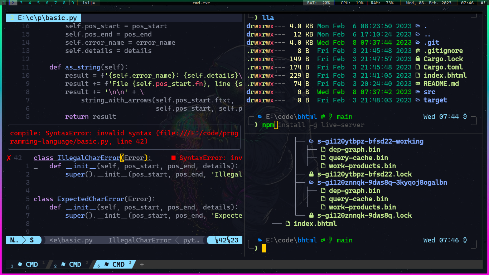
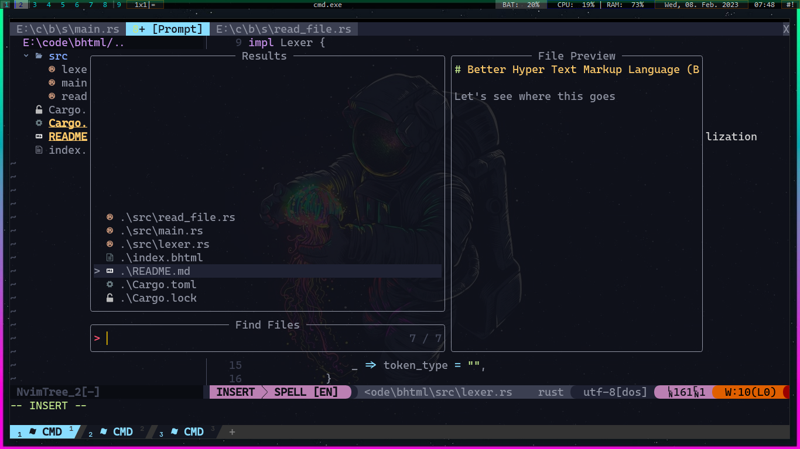

# DotFiles

## Screenshots

## Desktop Setup

### Bug.n

I'm using [Bug.n](https://github.com/fuhsjr00/bug.n) as a dynamic tiling window manager for windows

`git clone https://github.com/fuhsjr00/bug.n.git`

Place the folder wherever you want
If you want to add it in startup add a shortcut for bugn.exe inside %startup% directory
to get started [here](./Config.ini) is my configuration

### Wallpaper

## Terminal setup

### Wezterm Terminal Emulator

Download it [here](https://wezfurlong.org/wezterm/)
make a file in ~/.config/wezterm/wezterm.lua
my configuration [here](./wezterm.lua)

### Clink Configuration

Clink add Unix like cool functionality for your terminal(cmd)
Download it [here](https://github.com/chrisant996/clink)

there are some plugins that i use to make it more elegent

[fzf for clink](https://github.com/chrisant996/clink-fzf)  
[clink flex prompt](https://github.com/chrisant996/clink-flex-prompt) 
[clink z](https://github.com/chrisant996/z.lua) 
[clink completions](https://github.com/vladimir-kotikov/clink-completions) 

## Neovim

Command line text editor

`choco install neovim` 
`winget install Neovim.Neovim`

Add init.vim in your %localappdata%/nvim folder
my neovim config is [here](./init.vim)

## Automates

I use [autohotkey](https://www.autohotkey.com) for keybindings and some automations
you can use my automates [here](./automates.ahk)
